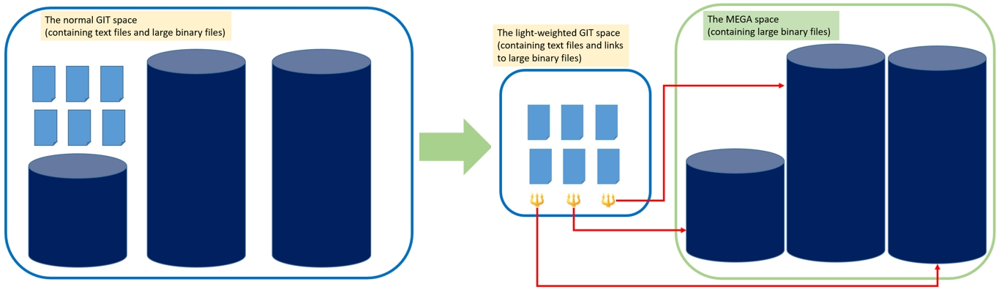
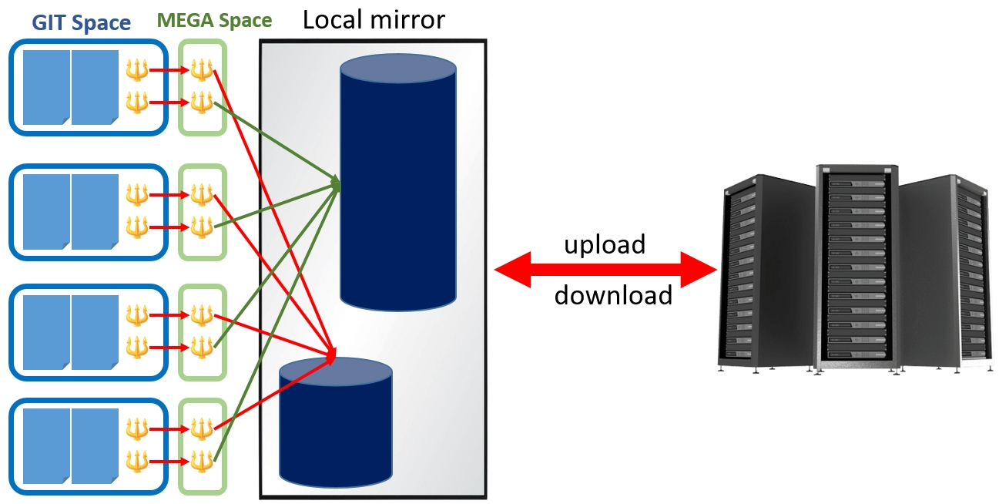

# Welcome to Git-Mega!

`Git-Mega` is a tool to track mega files within git repositories.
It is designed to help scientists, engineers, and others seamlessly integrate invaluable volumes of data with their Git workflow.

# 1. Why Git-Mega?

In today's big data landscape, we encounter enormous amounts of data on a daily basis. In many cases, we want to implement version control for large data volumes in addition to our source code. For instance, when conducting scientific/engineering simulations or working with machine learning models, we may want to version control the simulation results, prerequisite or training datasets, which can consist of massive amounts of data such as high-resolution images or videos. The size of these datasets can easily exceed 100 GB (some may even reach a few terabytes). 

Let's consider a scenario where two teams, each consisting of 25 members, share a repository that contains 100 GB of binary data but work from different locations. In practice, only one copy of the 100 GB data is needed at each site, and every team member should be able to access it transparently and effortlessly. It is unreasonable for each member to clone an individual copy of the data as it would put an enormous burden on network bandwidth as well as disk space, and significantly increase the clone time, leading to a poor user experience.  Unfortunately, the current GIT utilities available in the market, such as [git-lfs](https://git-lfs.com/), cannot meet the above version control requirements.

Upon closer examination,  we can see that most heavy-lift aspects of version controlling mega data is the transfer and archiving of these data. Tracking the change history is a light task in comparison. We only need to record when and why a file is changed and do not necessarily need to perform a git diff on two large binary files. This has inspired me to design this too, which allows users to leverage existing data transfer and archiving services, such as local disks, [NAS](https://www.seagate.com/blog/what-is-nas-master-ti/), [HPSS](https://computing.llnl.gov/projects/hpss), FTP, Amazon Web Services, etc.

# 2. How does Git-Mega work?

Git-Mega splits a repository into two spaces: the `GIT` space and the `MEGA` space. 

The `MEGA` space is where all the large volume of data actually reside, under the ".mega/" directory of a repository. 

The `GIT` space is the space we are familiar with. All files outside the MEGA space are in the GIT space.

A `MEGA` file is a file that has been deposited in the `MEGA` space and is referenced through a link in the `GIT` space. A `MEGA` file is named using the SHA512 hash of its content. This provides full assurance of data integrity and it is impossible for anyone to accidentally corrupt a file without being aware of it.

Users can choose how to transfer, archive, or back up a MEGA space by providing their own "download" and "upload" plugin scripts in the ".plugins-mega/" directory. Git-Mega provides some example plugins.

The following figure illustrates the difference between a regular `Git` repository and a `Git-Mega` repository.



`Git-Mega` introduces a local mirror so that multiple users in the same computer platform can share one single copy of mega data. 



# 3. System requirements

 - Linux systems or other Unix systems with GNU-compatible coreutils, findutils, and grep installed.
 - Git 2.15+
 - 64-bit computer systems are preferred

# 4. A quick tutorial
### 4.1. Clone and install the Git-Mega software in your computer system:
```
git clone https://github.com/git-mega/git-mega
cd git-mega
./install
```
This will install the git-mega software under the `$HOME/local/git-mega` directory.
Be sure to add `$HOME/local/git-mega` to your `PATH` enviromental variable in your .bashrc or .cshrc file.

### 4.2 git mega commands
run `git mega help` to show avaible git mega commands:
```
  qit mega [help]
  git mega hello
  git mega install
  git mega deposit/withdraw <dir|file>
  git mega upload/download
  git mega gethash file
  git mega compareDirs src dest
  git mega verify <dir>
  git mega repair <dir>
  git mega allHandsCheck
  git mega uninstall
```

### 4.3. Click the following link for more
[Git-Mega quick tutorial](tutorial.md)

# 5. Best practice to use Git-Mega
To track a large volume of data within a Git repository, it's best to use the `git mega deposit` command before `git add`. This will deposit large volume of data into the mega space first and then create links at the original file location. 

Using `git add` directly without first using `git mega deposit` can result in repeated computation of SHA512 hash during the "`git add`", "`git status`", and "`git commit`" steps. This can significantly increase the time required to process large amounts of data. By using `git mega deposit` before `git add`, the hash computation is only performed once during the deposit process, resulting in a more streamlined and efficient workflow.

# 6. Potential problems
-   Git-Mega has not been tested for files with empty spaces in their names.
-   Git-Mega cannot track mega files in the first or initital commit of a repository
-   It is recommended to avoid using Git-Lfs and Git-Mega simultaneously for a Git repository.
-   It is advised not to use the ".mega" string to name any Git-Mega MIRRORs.
-   Manually creating links inside a Git-Mega MIRROR is not recommended.
-   Git-Mega has not been fully tested for repositories with a pre-commit hook and/or a clean filter, which may cause conflicts.
-   (this applies only to those who use git worktrees) Limited testing has been done for git worktrees, so it is suggested to perform Git-Mega operations under the main worktree instead of linked worktrees.
 
# 7. [FAQ](FAQ.md)
Click this [link](FAQ.md) to visit FAQ

Click this [link](https://github.com/git-mega/git-mega/discussions) to ask questions or join discussions.
